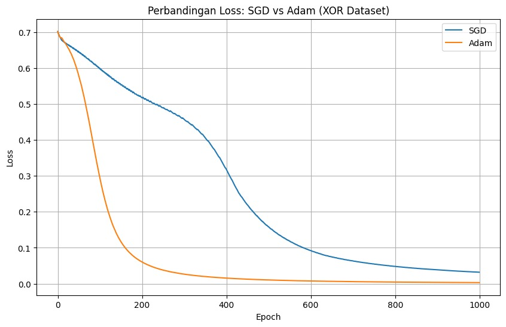

# Experiments — Optimizer Comparison (SGD vs Adam)

Bagian ini mendokumentasikan percobaan yang dilakukan untuk membandingkan performa dua optimizer populer dalam proses training neural network:

* **Stochastic Gradient Descent (SGD)**
* **Adam Optimizer**

Perbandingan dilakukan dengan mengamati bagaimana masing-masing optimizer memperbarui parameter model serta pengaruhnya terhadap penurunan nilai *loss function* selama training.

---

## 1. Tujuan Eksperimen

Eksperimen ini bertujuan untuk memahami:

* bagaimana strategi update parameter mempengaruhi proses learning,
* perbedaan kecepatan konvergensi antara optimizer,
* serta stabilitas training pada arsitektur Artificial Neural Network yang dibangun dari scratch.

---

## 2. Setup Eksperimen

### Model

* Arsitektur: Artificial Neural Network (ANN) from scratch
* Hidden layer menggunakan aktivasi ReLU
* Output layer menggunakan sigmoid (binary classification)

### Dataset

Dataset yang digunakan adalah **XOR dataset**, sebuah dataset klasik yang bersifat non-linear dan sering digunakan untuk menguji kemampuan neural network dalam mempelajari pola kompleks.

---

### Loss Function

Binary Cross Entropy (BCE):

$$
L = -\left[y\log(\hat{y}) + (1-y)\log(1-\hat{y})\right]
$$

---

### Optimizer yang Dibandingkan

#### 1️⃣ Stochastic Gradient Descent (SGD)

Update parameter dilakukan menggunakan learning rate konstan:

$$
W := W - \alpha \nabla W
$$

Karakteristik utama:

* learning rate bersifat statis
* update parameter sederhana
* konvergensi stabil namun relatif lambat

---

#### 2️⃣ Adam Optimizer

Adam mengkombinasikan konsep **momentum** dan **adaptive learning rate**.

Update parameter menggunakan estimasi momen pertama dan kedua dari gradient:

$$
m_t = \beta_1 m_{t-1} + (1-\beta_1) g_t
$$

$$
v_t = \beta_2 v_{t-1} + (1-\beta_2) g_t^2
$$

Kemudian dilakukan bias correction sebelum update parameter.

---

### Hyperparameter Adam

Nilai hyperparameter yang digunakan:

* $\beta_1 = 0.9$
* $\beta_2 = 0.999$
* $\epsilon = 10^{-8}$

Nilai ini merupakan konfigurasi standar yang umum digunakan pada banyak implementasi deep learning.

---

## 3. Hasil Observasi

Berdasarkan hasil training:

* Pada **epoch ke-200**, Adam optimizer mampu menurunkan nilai loss mendekati minimum lebih cepat dibandingkan SGD.
* SGD menunjukkan penurunan loss yang lebih bertahap namun stabil sepanjang training.
* Adam memperlihatkan konvergensi yang lebih cepat karena mampu menyesuaikan learning rate secara adaptif untuk setiap parameter.

---

## 4. Visualisasi Training Loss

Berikut merupakan perbandingan kurva loss selama proses training.

<!-- INSERT IMAGE: training_loss_comparison.png -->

<!-- Grafik berisi:
     - Kurva Loss SGD
     - Kurva Loss Adam
     - Sumbu X: Epoch
     - Sumbu Y: Loss
-->

---

## 5. Analisis

Perbedaan performa kedua optimizer dapat dijelaskan melalui mekanisme update parameter.

### SGD

SGD menggunakan learning rate tetap sehingga:

* arah update konsisten,
* namun membutuhkan lebih banyak iterasi untuk mencapai minimum,
* sensitif terhadap pemilihan learning rate.

SGD dapat dianalogikan seperti berjalan menuju lembah dengan langkah konstan.

---

### Adam

Adam menggunakan estimasi momentum dan adaptive learning rate sehingga:

* langkah update lebih stabil,
* mampu mempercepat konvergensi,
* lebih tahan terhadap skala gradient yang berbeda.

Pada eksperimen ini, mekanisme tersebut memungkinkan model lebih cepat menemukan minimum loss pada dataset XOR yang bersifat non-linear.

---

## 6. Insight Eksperimen

Beberapa insight yang diperoleh:

* Optimizer sangat mempengaruhi dinamika training meskipun arsitektur model sama.
* Adaptive learning rate membantu mempercepat konvergensi pada problem non-linear.
* SGD tetap memberikan learning trajectory yang stabil meskipun lebih lambat.

Eksperimen ini menunjukkan bahwa performa optimizer tidak hanya bergantung pada teori, tetapi juga pada karakteristik dataset dan arsitektur model.

---

## 7. Kesimpulan

Pada eksperimen ini:

* **Adam optimizer** mencapai konvergensi lebih cepat dan menghasilkan loss yang lebih rendah pada epoch awal.
* **SGD** menunjukkan proses learning yang lebih gradual namun konsisten.

Hal ini menegaskan bahwa pemilihan optimizer merupakan komponen penting dalam proses training neural network, bahkan pada implementasi ANN sederhana sekalipun.
