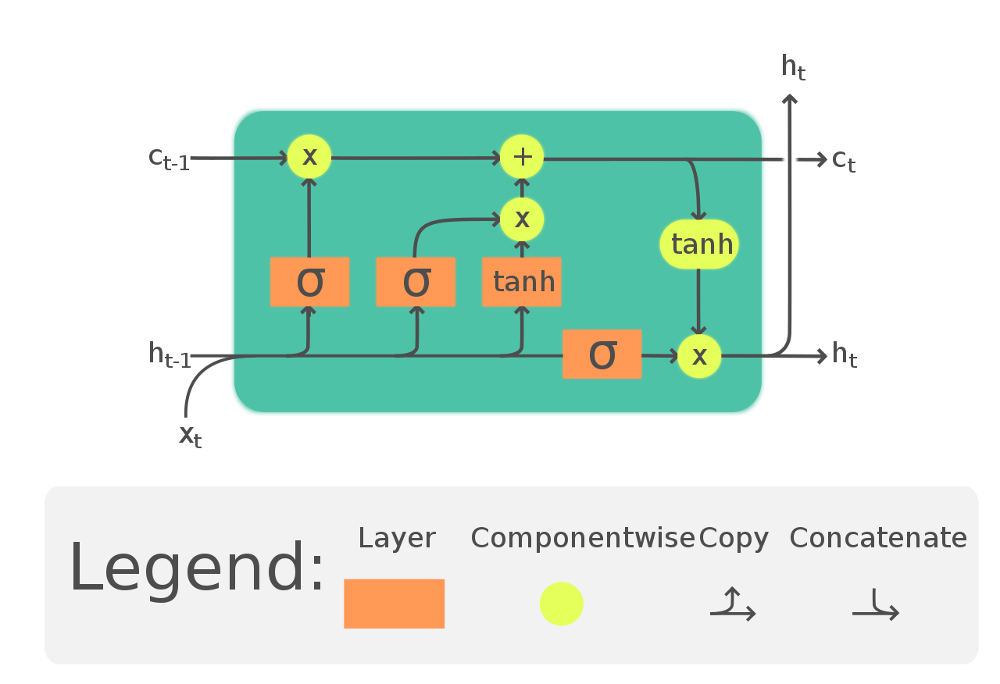

# Long Short-Term Memory (LSTM) From Scratch

Implementasi arsitektur **Long Short-Term Memory (LSTM)** yang dibangun dari nol (*from scratch*) hanya menggunakan NumPy, sebagai bagian dari seri proyek *Deep Learning From Scratch*.

---

## Motivasi & Tujuan Project

Setelah mengimplementasikan Vanilla RNN, kita menemukan satu masalah fundamental: **RNN kesulitan mempertahankan konteks saat sekuens data semakin panjang**. 

LSTM diciptakan oleh Hochreiter & Schmidhuber (1997) untuk mengatasi keterbatasan tersebut dengan memperkenalkan struktur *cell state* dan mekanisme gerbang (*gating mechanisms*).

Tujuan utama dari proyek ini adalah:
* Mengimplementasikan LSTM beserta 4 gerbang utamanya secara manual tanpa framework deep learning.
* Memahami mekanisme *Constant Error Carousel (CEC)* yang mencegah *vanishing gradient*.
* Mengimplementasikan propagasi turunan *Backpropagation Through Time (BPTT)* pada arsitektur berbasis *gated memory*.
* Memahami posisi LSTM dalam **evolusi arsitektur pemrosesan sekuens (RNN → LSTM → Transformer)**.

---

## Evolusi Arsitektur: Dari RNN ke LSTM hingga Transformer

### 1. Kekurangan Arsitektur Sebelumnya (Vanilla RNN)

Pada modul sebelumnya [3_RNN](file:///home/khaerul/Documents/github/deep-learning-from-scratch/3_RNN), kita mengimplementasikan Vanilla RNN dengan persamaan hidden state:

$$
h_t = \tanh(W_{xh} x_t + W_{hh} h_{t-1} + b_h)
$$

Arsitektur RNN ini memiliki beberapa kekurangan kritis:
* **Vanishing Gradient**: Saat proses BPTT dilakukan melintasi sekuens yang panjang ($T > 10$), turunan hidden state membutuhkan perkalian berulang matriks bobot $W_{hh}^T$. Jika nilai eigen matriks $< 1$, gradient berkurang secara eksponensial menuju nol.
* **Exploding Gradient**: Sebaliknya, jika nilai eigen $> 1$, gradient dapat bertambah pesat hingga menyebabkan nilai *NaN* atau *Inf*.
* **Kegagalan Long-Term Dependencies**: Akibat vanishing gradient, model RNN praktis "lupa" terhadap kata-kata di awal kalimat dan hanya mengandalkan beberapa kata terakhir.

---

### 2. Bagaimana LSTM Solusi Kekurangan RNN

LSTM menutupi kekurangan RNN dengan memperkenalkan **dua jalur memori dan 3 gerbang kontrol**:

1. **Memori Terpisah (Cell State $C_t$ & Hidden State $h_t$)**:
   - $C_t$ berfungsi sebagai memori jangka panjang (*long-term memory*) yang mengalir secara linear.
   - $h_t$ berfungsi sebagai memori jangka pendek (*short-term memory*) untuk prediksi saat ini.

2. **Mekanisme Gating Presisi**:
   - **Forget Gate ($f_t$)**: Menentukan berapa banyak memori lama yang dibuang.
   - **Input Gate ($i_t$) & Candidate Cell ($\tilde{C}_t$)**: Menentukan informasi baru yang ditambahkan.
   - **Output Gate ($o_t$)**: Menentukan bagian memori yang dikeluarkan ke hidden state.

3. **Constant Error Carousel (CEC)**:
   Pembaruan cell state bersifat aditif:
   $$
   C_t = f_t \odot C_{t-1} + i_t \odot \tilde{C}_t
   $$
   Karena operasinya berbentuk penjumlahan (bukan perkalian matriks berulang), gradient dapat mengalir mundur melintasi waktu tanpa terdegradasi secara eksponensial.

---

### 3. Kekurangan & Keterbatasan LSTM

Meskipun LSTM jauh lebih unggul dibandingkan RNN, LSTM tetap memiliki keterbatasan fundamental:

* **Sequential Bottleneck ($O(T)$)**: LSTM harus memproses kata demi kata secara berurutan ($t=1, t=2, \dots, t=T$). Akibat ketergantungan waktu ini, **pelatihan LSTM tidak dapat diparalelkan di GPU sepanjang dimensi waktu**.
* **Memory Saturation pada Sekuens Sangat Panjang**: Untuk teks berukuran paragraf panjang atau dokumen ($T > 1000$), kemampuan pemampatan konteks dalam vektor $C_t$ berukuran tetap mulai mengalami penurunan performa.
* **Kompleksitas Komputasi Tinggi**: Setiap langkah waktu memerlukan perhitungan 4 pasang matriks bobot ($W_f, W_i, W_o, W_c$), yang meningkatkan beban memori dan waktu komputasi.

---

### 4. Bagaimana Transformer Selanjutnya Memperbaiki Kekurangan LSTM

Kekurangan LSTM di atas menjadi alasan lahirnya arsitektur **Transformer** (Vaswani et al., 2017), yang akan diimplementasikan pada modul berikutnya:

* **Paralelisasi Penuh (Menghilangkan Recurrence)**: Transformer menghilangkan loop waktu sekuensial. Seluruh kata dalam kalimat diproses secara bersamaan (*simultaneous matrix operations*) memanfaatkan GPU.
* **Mekanisme Self-Attention**: Berbeda dengan LSTM yang harus meneruskan memori step-by-step, *Self-Attention* memungkinkan setiap kata untuk berhubungan langsung dengan kata lainnya dalam jarak $O(1)$, tanpa peduli seberapa jauh jaraknya dalam kalimat.
* **Positional Encoding**: Urutan kata dipertahankan melalui enkripsi posisi langsung pada input embedding, bukan melalui urutan pemrosesan waktu.

| Fitur / Karakteristik | Vanilla RNN | LSTM | Transformer |
| :--- | :--- | :--- | :--- |
| **Penyimpanan Konteks** | Sangat Pendek | Jangka Menengah / Panjang | Sangat Panjang (Global) |
| **Gradient Flow** | Vanishing / Exploding | Stabil (via CEC & Gates) | Penuh (via Residual Connections) |
| **Paralelisasi Training** | Tidak Bisa ($O(T)$) | Tidak Bisa ($O(T)$) | **Bisa Diparalelkan Penuh** |
| **Jarak Hubungan Token** | $O(T)$ step | $O(T)$ step | **$O(1)$ direct attention** |

---

## Gambaran Arsitektur LSTM Cell



---

## Cakupan Pembahasan & Struktur Kode

File utama [main.py](file:///home/khaerul/Documents/github/deep-learning-from-scratch/4_LSTM/main.py) mengimplementasikan kelas `LongShortTermMemory` yang mencakup:

* **Embedding Layer**: Inisialisasi lookup table embedding kata ($E$).
* **LSTM Cell Core**: Komputasi 4 gerbang ($f_t, i_t, o_t, \tilde{C}_t$) dan pembaharuan $C_t, h_t$.
* **Projection Head**: Layer Fully Connected (MLP) dengan fungsi aktivasi ReLU & Softmax output.
* **BPTT Engine**: Derivasi rantai turunan eksplisit untuk seluruh gerbang dan layer FC.
* **Optimizer**: Dukungan pembaruan bobot berbasis **Adam** dan **SGD**.
* **Visualisasi & Inference**: Visualisasi progress bar pelatihan dan fungsi *autoregressive text generation*.

---

## Dokumentasi

Penjelasan matematika lengkap dan penurunan rumus BPTT tersedia pada folder `docs/`:

* [docs/architecture.md](file:///home/khaerul/Documents/github/deep-learning-from-scratch/4_LSTM/docs/architecture.md) — Penjelasan detail rumus forward pass, Constant Error Carousel (CEC), BPTT 4 gerbang, dan layer MLP.

---

## Cara Menjalankan

Untuk menjalankan proses training dan pengujian prediksi teks LSTM:

```bash
python main.py
```

---

## Catatan Penulis

Implementasi ini merupakan langkah ke-4 dalam perjalanan membangun deep learning dari nol. Memahami bagaimana LSTM mengontrol aliran informasi melalui gerbang memberikan fondasi intuitif sebelum mempelajari arsitektur berbasis *Attention* dan *Transformer*.
