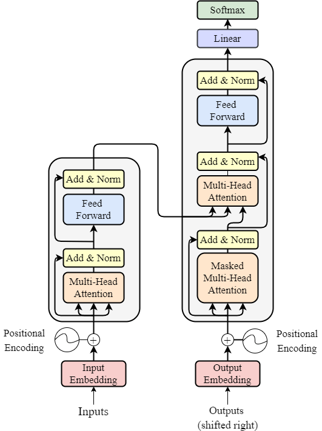
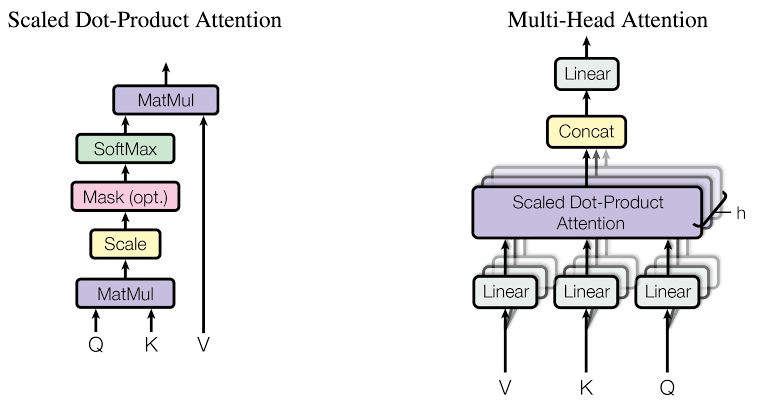

# Architecture Overview — Transformer Architecture & Self-Attention

Dokumen ini menjelaskan arsitektur dan prinsip kerja **Transformer** yang diimplementasikan dari nol (*from scratch*). Transformer yang diperkenalkan oleh Vaswani et al. (2017) dalam makalah *"Attention Is All You Need"* merupakan fondasi utama dari model-model bahasa modern (seperti GPT, BERT, LLaMA, dan Gemini).

---

## 1. Gambaran Umum Arsitektur Transformer

Berbeda dari arsitektur rekuren seperti RNN dan LSTM yang memproses sekuens data secara bertahap ($t=1, t=2, \dots, t=T$), Transformer memproses **seluruh token sekuens secara bersamaan** (*parallel computation*).

Arsitektur ini mengandalkan **Mekanisme Self-Attention** untuk menangkap keterkaitan antar kata dalam sekuens tanpa peduli seberapa jauh jarak antar kata tersebut ($O(1)$ *direct relationship*).



Setiap blok Transformer terdiri dari dua komponen utama:
1. **Multi-Head Attention (MHA)** dengan *Look-Ahead Masking* untuk membatasi akses token masa depan pada tugas autoregresif.
2. **Position-wise Feed-Forward Network (FFN)** untuk transformasi fitur non-linear pada setiap posisi.

Setiap sub-layer dibungkus dengan koneksi residual (**Residual Connection / Add**) dan **Layer Normalization (Norm)**.

---

## 2. Positional Encoding (Sinusoidal)

Karena Transformer tidak menggunakan jaringan rekuren (*recurrent loop*), model tidak memiliki kesadaran bawaan mengenai urutan kata dalam kalimat.

Untuk mengatasi ini, **Positional Encoding** ditambahkan secara langsung pada input word embeddings:

$$
X_{\text{pos}} = X_{\text{embedding}} + \text{PE}
$$

Matriks Positional Encoding ($\text{PE}$) dihitung menggunakan fungsi gelombang sinus dan kosinus pada berbagai frekuensi:

$$
\text{PE}_{(pos, 2i)} = \sin\left(\frac{pos}{10000^{2i/d_{\text{model}}}}\right)
$$

$$
\text{PE}_{(pos, 2i+1)} = \cos\left(\frac{pos}{10000^{2i/d_{\text{model}}}}\right)
$$

Dimana:
* $pos$: Posisi kata dalam sekuens ($0, 1, 2, \dots$).
* $i$: Indeks dimensi fitur embedding ($0, 1, \dots, d_{\text{model}}/2$).
* $d_{\text{model}}$: Dimensi representasi token (`d_embeds`).

Fungsi gelombang ini memungkinkan model mempelajari hubungan posisi relatif antar kata secara kontinu.

---

## 3. Scaled Dot-Product & Multi-Head Attention

Mekanisme Attention memungkinkan setiap kata dalam sekuens "memperhatikan" kata-kata lain dan menentukan tingkat relevansinya.



### 3.1 Proyeksi Linear Query, Key, Value ($Q, K, V$)

Untuk setiap head $i$, input $X$ diproyeksikan menggunakan matriks bobot yang dapat dipelajari:

$$
Q_i = X W_Q^i, \quad K_i = X W_K^i, \quad V_i = X W_V^i
$$

Dimana:
* $Q_i \in \mathbb{R}^{T \times d_k}$: Matriks **Query** (apa yang dicari oleh kata saat ini).
* $K_i \in \mathbb{R}^{T \times d_k}$: Matriks **Key** (kunci identitas kata lain).
* $V_i \in \mathbb{R}^{T \times d_k}$: Matriks **Value** (kandungan informasi kata lain).
* $d_k = d_{\text{model}} / \text{num\_heads}$.

---

### 3.2 Scaled Dot-Product Attention & Masking

Perkalian matriks antara $Q$ dan $K^T$ menghasilkan *Attention Scores*:

$$
\text{Attention Scores} = \frac{Q K^T}{\sqrt{d_k}}
$$

* **Skalar $\sqrt{d_k}$**: Dibagi dengan $\sqrt{d_k}$ untuk mencegah nilai perkalian matriks terlalu besar pada dimensi yang tinggi, yang dapat menyebabkan gradient fungsi Softmax mendekati nol (*vanishing gradient*).
* **Look-Ahead Masking ($M$)**: Pada dekoder autoregresif, matriks mask segitiga atas (*upper triangular matrix*) bernilai $-\infty$ ($10^{-9}$) ditambahkan untuk mencegah token melihat kata di masa depan selama pelatihan:

$$
S = \text{Softmax}\left(\frac{Q K^T}{\sqrt{d_k}} + M\right)
$$

$$
\text{Head}_i = S \cdot V
$$

---

### 3.3 Penggabungan Multi-Head (Concatenation & Output Projection)

Output dari seluruh head digabungkan secara sejajar (*concatenated*) lalu diproyeksikan kembali ke dimensi $d_{\text{model}}$ menggunakan matriks $W_O$:

$$
\text{MultiHead}(Q, K, V) = \text{Concat}(\text{Head}_1, \text{Head}_2, \dots, \text{Head}_h) W_O
$$

---

## 4. Layer Normalization & Residual Connections

Untuk menjaga stabilitas aliran gradient pada jaringan yang dalam, diterapkan teknik **Add & Norm**:

$$
\text{SubLayer}_{\text{out}} = \text{LayerNorm}(X + \text{SubLayer}(X))
$$

### 4.1 Persamaan Layer Normalization

Berbeda dengan Batch Normalization yang menghitung rerata antar sampel batch, Layer Normalization menghitung rerata ($\mu$) dan varians ($\sigma^2$) **di sepanjang dimensi fitur per token**:

$$
\mu = \frac{1}{d} \sum_{j=1}^{d} x_j, \quad \sigma^2 = \frac{1}{d} \sum_{j=1}^{d} (x_j - \mu)^2
$$

$$
\hat{x} = \frac{x - \mu}{\sqrt{\sigma^2 + \epsilon}}
$$

$$
\text{LayerNorm}(x) = \gamma \odot \hat{x} + \beta
$$

Dimana $\gamma$ dan $\beta$ adalah parameter skala dan pergeseran yang dipelajari selama pelatihan.

---

## 5. Position-wise Feed-Forward Network (FFN)

Output dari Layer Norm pertama diteruskan ke jaringan Feed-Forward (FFN) yang terdiri dari dua transformasi linear dengan aktivasi non-linear **ReLU** di antaranya:

$$
\text{FFN}(x) = \max(0, x W_1 + b_1) W_2 + b_2
$$

Dimana:
* $W_1 \in \mathbb{R}^{d_{\text{model}} \times 4d_{\text{model}}}$, $b_1 \in \mathbb{R}^{1 \times 4d_{\text{model}}}$
* $W_2 \in \mathbb{R}^{4d_{\text{model}} \times d_{\text{model}}}$, $b_2 \in \mathbb{R}^{1 \times d_{\text{model}}}$

FFN memberikan kapasitas ekstra bagi model untuk mempelajari representasi fitur non-linear pada setiap posisi token secara terpisah.

---

## 6. Alur Propagasi Balik (Backward Pass)

Backpropagation pada Transformer dihitung secara terbalik melintasi seluruh sub-layer:

1. **Output Linear Head ($W_{hy}$)**:
   $$
   \delta = \hat{Y} - Y_{\text{onehot}}, \quad dW_{hy} = X_{\text{final}}^T \delta
   $$
2. **Layer Norm 2 Backward**: Menghitung $d\gamma_2, d\beta_2,$ dan mempropagasi gradient ke FFN.
3. **FFN Backward**: Turunan linear layer 2, aktivasi ReLU, dan linear layer 1.
4. **Layer Norm 1 Backward**: Menghitung $d\gamma_1, d\beta_1,$ dan mempropagasi gradient ke Multi-Head Attention.
5. **Multi-Head Attention Backward**:
   - Turunan perkalian matriks output projection ($W_O$).
   - Turunan Softmax attention scores ($dS$).
   - Turunan perkalian matriks Query ($dW_Q$), Key ($dW_K$), dan Value ($dW_V$).
   - Akumulasi gradient ke input embedding ($dX$).

---

## Ringkasan Komputasi Sub-Layer

```text
Input Tokens X ──> [ Embedding + Positional Encoding ]
                           │
                           ▼
               ┌───────────────────────┐
               │ Multi-Head Attention  │
               └───────────────────────┘
                           │
                           ▼
               [ Add & Layer Normalization ]
                           │
                           ▼
               ┌───────────────────────┐
               │ Feed-Forward Network  │
               └───────────────────────┘
                           │
                           ▼
               [ Add & Layer Normalization ] ──> Linear (Why) ──> Softmax Output
```
